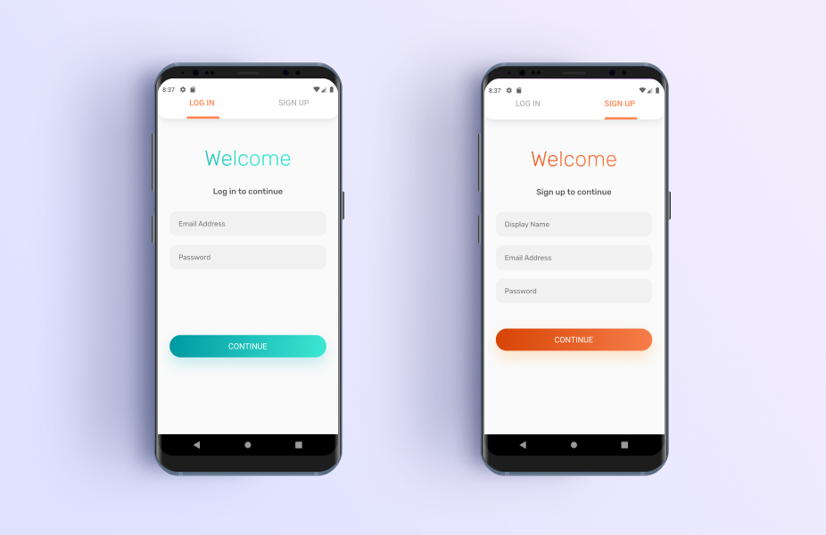
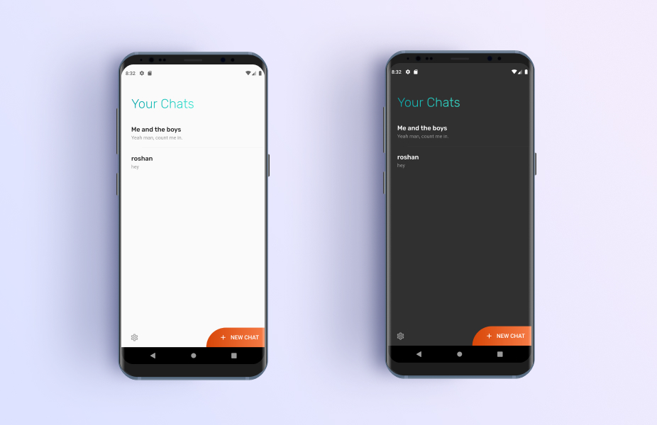
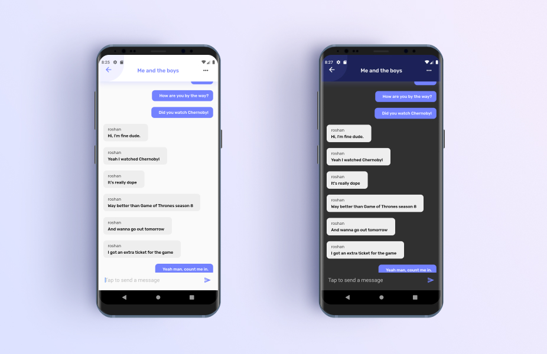
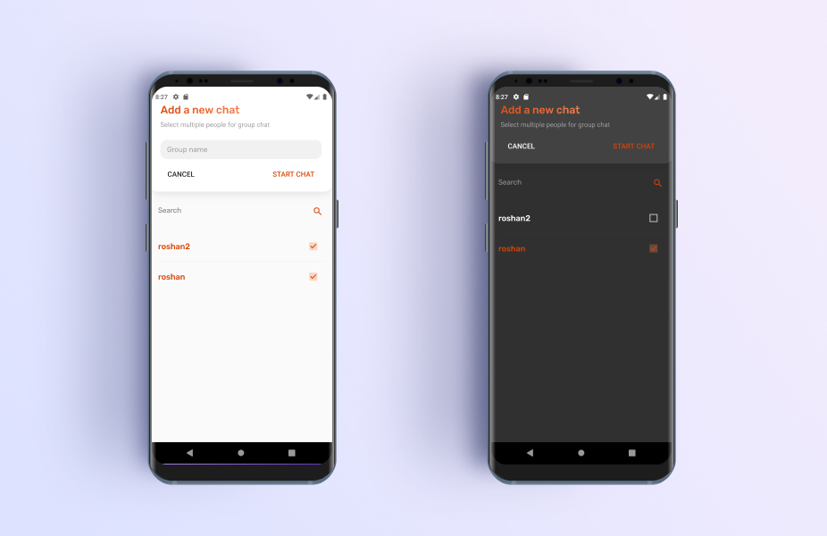
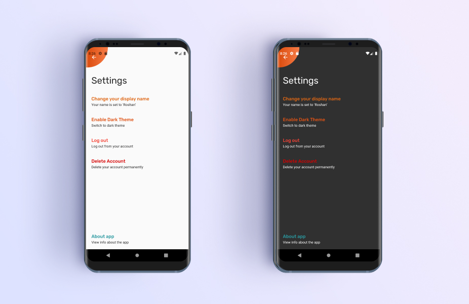

# Chap Client

It's a fully functional and secure cross platform chat application built using flutter and uses a graphql server that acts as an interface between the Database and the client.

## Contributors

[Vineesh](http://github.com/vineeshvk) (me) - **Front-end and Back-end developer**

[Roshan G Rahman](http://github.com/roshanrahman) - **Designer**

## Server

[Chat app server](http://github.com/vineeshvk/chat-app-server) is the used as the backend for this app.

## Release

> Download the [chap.apk](https://github.com/vineeshvk/chat-app-flutter/releases/download/1.0/Chat-flutter.apk) for android

## Screenshots







## Features
- signup and signin
- create individual and group chats and delete them
- view and add messages
- dark mode
- notification(only for android)
- instant messages

## Tools used
- [Flutter & Dart](http://flutter.dev)
- [Firebase Messaging Flutter](https://pub.dev/packages/firebase_messaging)
- [Provider State Management](https://pub.dev/packages/provider)
- [Graphql Flutter](https://pub.dev/packages/graphql_flutter)
- [Shared Preferences](https://pub.dev/packages/shared_preferences)

## How to run

First go and setup the [server](http://github.com/vineeshvk/chat-app-server) for the chat app
```
flutter packages get
```

```
flutter run --release
```
